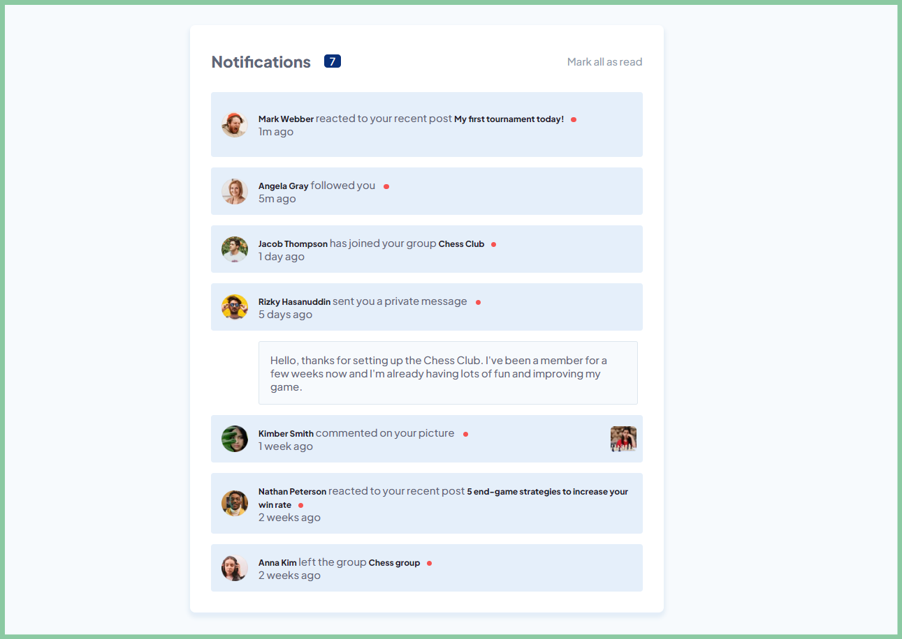

# Frontend Mentor - Notifications page solution

This is a solution to the [Notifications page challenge on Frontend Mentor](https://www.frontendmentor.io/challenges/notifications-page-DqK5QAmKbC). Frontend Mentor challenges help you improve your coding skills by building realistic projects. 

### Screenshot

### Links

- Solution URL: (https://github.com/Tome190/notifications-page-main)
- Live Site URL: (https://tome-notifications-page.netlify.app/)

### Built with

- Semantic HTML5 markup
- CSS custom properties
- Flexbox
- CSS Grid
- [React](https://reactjs.org/) - JS library
- [Vite](https://vitejs.dev/) - Frontend Bundler

## Author

- Frontend Mentor -(https://www.frontendmentor.io/profile/Grasit)

